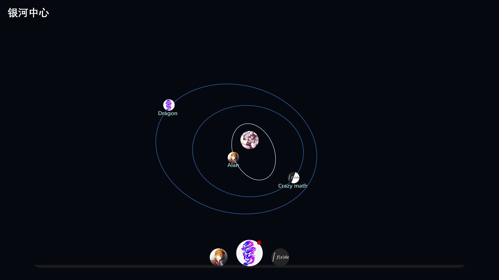
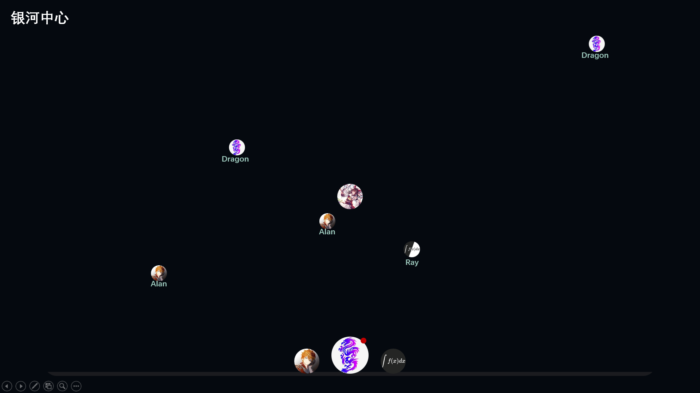
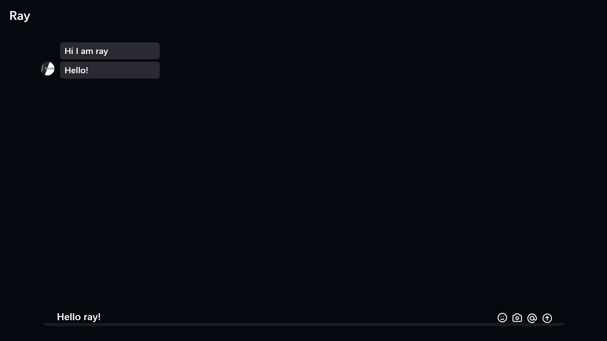

最近收到微信QQ的百般摧残

手机的内存情况也不容乐观

所以……为什么不自己开发一款呢🤔

于是就出现了这个项目：chat-plus，一款船新的`开源`聊天软件

但凭借我一人的力量做到这件事是很难的，更别说我前端不大行（qwq）

因此我在这里广求各路大佬出手相助

--- 

这个项目的职位，预计人数及其要求

- 后端开发
  > 预计人数：2人

  > 要求：
  > 熟悉node.js，并且回答出下面这串代码的输出
  >
  > ```javascript
  > new Promise((resolve, reject)=>{
  >   console.log(`${'\x1B[32m'}hello world!${'\x1B[0m'}`);
  >   setTimeout(() => {
  >     console.log(`time: ${new Date().getTime()}`);
  >     resolve({}+[]);
  >   }, 1000);
  > })
  > .then(value => new Promise((resolve, reject)=>{
  >   if(typeof(value) === void 0){
  >     resolve(114514);
  >   }else{
  >     reject(1919810);
  >   }
  > }))
  > .then(value=>{
  >   console.log(value);
  > })
  > .catch(error=>{
  >   console.log(error);
  > })
  > ```

- 前端开发
  > 预计人数：3人

  > 要求：熟悉vue的开发（前端采用vue+vite）
  > 并描述出下面这段代码实现的效果
  >
  > (vue-cli)
  > ```javascript
  > // main.js
  > import { createApp } from 'vue'
  >
  > createApp({
  >  data() {
  >    return {
  >      count: 0
  >    }
  >  }
  > }).mount('#app')
  >```
  >
  >```html
  > <!-- App.vue, <template> -->
  > <div id="app">
  >   <button @click="count++">
  >     Count is: {{ count }}
  >   </button>
  > </div>
  >```

- 群摸鱼人员
- 人数：不限
- 要求：没有


另附 项目效果图（画的大饼）





最后，欢迎加入我们！

qq群 955168585

